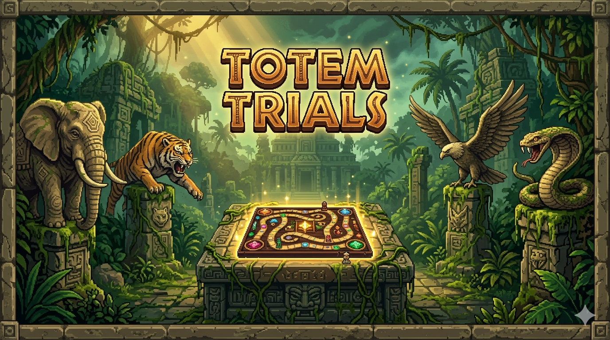
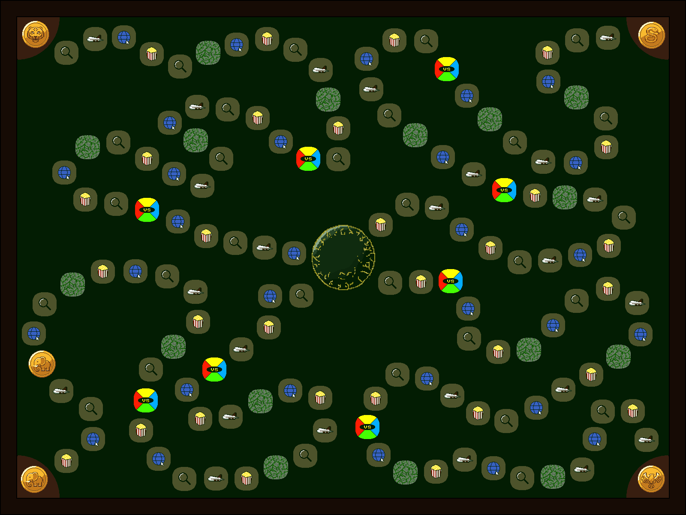

# 🌿 Totem Trials — La Conquête de Jumanji

<div align="center">



> **A multiplayer trivia board game built in Java/JavaFX, inspired by the Jumanji universe.**

[](https://openjdk.org/)
[](https://openjfx.io/)
[](https://maven.apache.org/)
[](https://junit.org/junit5/)
[]()
[]()

</div>

---

## 📌 Table of Contents

- [Overview](#-overview)
- [Gameplay](#-gameplay)
- [Characters & Passives](#-characters--passives)
- [Special Tiles](#-special-tiles)
- [Architecture](#-architecture)
- [Data Format](#-data-format)
- [Setup & Run](#️-setup--run)
- [Project Structure](#-project-structure)
- [Release Plan](#-release-plan)
- [Backlog](#-backlog)
- [Team](#-team)

---

## 🗺️ Overview

**Totem Trials** is a 2–4 player trivia board game developed as a Java integration project at [HELHa](https://www.helha.be/) (Haute École Louvain en Hainaut, Mons).

The game blends TTMC-style trivia mechanics with a **pixel-art Jumanji aesthetic**. Players choose a character, each with a unique passive ability, and race across a jungle board toward the center — answering questions, triggering duels, and navigating traps along the way.

<div align="center">



*Pixel-art board prototype — subject to change*

</div>

---

## 🎮 Gameplay

### Objective

Be the first player to reach the **center of the board** and answer a final question to claim victory.

### Question Themes

| Theme | Description |
|-------|-------------|
| 🎬 Entertainment | Movies, TV series, video games |
| 💻 Informatics | Programming, computer science concepts |
| ✈️ Tourism | Geography, landmarks, world travel |
| 🔍 Mystery – Jumanji | Trivia from the Jumanji universe |

Questions range from difficulty **1** (easy) to **4** (expert).

### Turn Flow

```
1. THEME      → Tile color dictates the question category
2. SELF-EVAL  → Player declares confidence: 1–4 (= difficulty + tiles to advance)
3. QUESTION   → 4 choices displayed
4. RESULT     → Correct: advance N tiles | Incorrect: stay or retreat 1 tile
```

---

## 🐾 Characters & Passives

Each character has a **unique passive ability**, usable **once per game**.

> 📁 **Where to put token images for GitHub:**  
> Copy your token `.png` files into `docs/assets/tokens/` at the root of the repo.  
> GitHub renders images using relative paths — as long as the files exist there, the table below will display them correctly.

<div align="center">

| Token | Character | Passive |
|-------|-----------|---------|
|  | **Elephant** | Skip the current question → receive a new one at the same theme & difficulty |
|  | **Snake** | Change the question's theme to any of the other 3 themes |
|  | **Eagle** | Places a hidden trap tile on the board; opponents who land on it trigger a group penalty question |
|  | **Tiger** | Reduces answer choices from 4 down to 2 |

</div>

> All passives are **single-use** — choose the right moment wisely.

---

## 🧩 Special Tiles

| Tile | Effect |
|------|--------|
| ⚔️ **VS — Duel** | Land here to challenge any opponent. Each player picks the other's theme. Loser retreats 3 tiles. Draw = no effect. |
| 🌿 **Liane — Shortcut** | Faster route to center. Must accept a question (min difficulty 3). Correct → shortcut taken. Wrong → retreat N tiles equal to difficulty attempted. |
| ⭐ **Bonus Tile** | Freely choose theme + difficulty. No penalty on failure; advance = difficulty on success. |
| 💀 **Trap Tile** | Draw a malus card or lose next turn. Positions are randomized each game. |
| 🔴 **Last Tile** | Landing here forces a mandatory retreat before the final question. |

---

## 🏗️ Architecture

### Design Pattern: STATE

The game lifecycle is fully managed through the **State** design pattern. Each state encapsulates its own logic, transitions, and UI rendering.

```
        ●
        │
        ▼
┌─────────────────────┐
│  InitialisationPartie│ ◄──────────────────────────┐
└─────────┬───────────┘                             │ [RestartPartie]
          │ [FinChargement]                         │
          ▼                                         │
     ┌─────────┐   [JoueurAppuieSurPause]   ┌───────────┐
     │ EnCours │ ──────────────────────────► │   Pause   │
     │         │ ◄────────────────────────── │           │
     └────┬────┘   [JoueurAppuieSurReprendre]└─────┬─────┘
          │ [JoueurAtteintCentre]                  │
          ▼                                        │ [JoueurAppuieSurQuitter]
     ┌──────────┐                                  │
     │ FinPartie│ ─────────────────────────────────┘
     └──────────┘
          │ [JoueurAppuieSurQuitter / RestartPartie]
          ▼
          ●
```

### MVC Overview

```
src/main/java/
├── model/
│   ├── Plateau.java                  # Board: grid of Case objects
│   ├── Case.java                     # Base tile
│   │   ├── CaseBonus.java
│   │   ├── CasePiege.java
│   │   ├── CaseDepart.java
│   │   ├── CaseFin.java
│   │   └── CaseRegle.java
│   ├── Joueur.java                   # Player: pseudo, position, character
│   ├── Personnage.java               # Character + passive
│   ├── Tour.java                     # Single turn logic
│   ├── Manche.java                   # Round across all players
│   ├── DeroulementPartie.java        # Game loop (couples State + players)
│   ├── EtatPartie.java               # State interface
│   │   ├── EtatInitialisationPartie.java
│   │   ├── EtatEnCours.java
│   │   ├── EtatEnPause.java
│   │   └── EtatFinPartie.java
│   ├── Question.java
│   ├── Reponse.java
│   ├── Theme.java
│   └── GestionnaireDeCartes.java     # JSON loader + dispatcher
├── view/
│   └── (JavaFX FXML scenes)
├── controller/
│   └── (JavaFX controllers)
└── exception/
    └── (custom business exceptions)
```

---

## 📦 Data Format

Questions are loaded from `.json` files, one per theme. The format is a flat array:

```json
[
    {
        "theme": "Tourism",
        "subject": "Tourism",
        "difficulty": 1,
        "question": "What is the most visited country in the world?",
        "answer": "France",
        "choices": ["France", "Spain", "USA", "China"]
    },
    {
        "theme": "Tourism",
        "subject": "Tourism",
        "difficulty": 4,
        "question": "Which of these countries has no Roman amphitheater in its territory?",
        "answer": "Norway",
        "choices": ["Norway", "Tunisia", "Croatia", "Bulgaria"]
    }
]
```

**Rules:**
- `answer` must be one of the values present in `choices`
- `difficulty` is an integer from `1` to `4`
- `choices` always contains exactly **4 options**
- Display order is shuffled at runtime — no hardcoded correct-answer position

---

## ⚙️ Setup & Run

### Prerequisites

| Tool | Version |
|------|---------|
| JDK | 17+ |
| JavaFX SDK | 17+ |
| Maven | 3.8+ |
| JUnit | 5 |

### Clone & Build

```bash
git clone https://github.com//totem-trials.git
cd totem-trials
mvn clean package
```

### Run

```bash
java --module-path /path/to/javafx-sdk/lib \
     --add-modules javafx.controls,javafx.fxml \
     -jar target/totem-trials.jar
```

> Using IntelliJ or Eclipse? Configure the JavaFX SDK as a module dependency and add the `--add-modules` flag to your VM options.

### Tests

```bash
mvn test
```

Coverage report generated at `target/site/jacoco/index.html`.

---

## 📁 Project Structure

```
totem-trials/
├── src/
│   ├── main/
│   │   ├── java/                  # Application source
│   │   └── resources/
│   │       ├── fxml/              # JavaFX layout files
│   │       └── css/               # Stylesheets
│   └── test/
│       └── java/                  # JUnit 5 tests
├── data/
│   └── questions/
│       ├── entertainment.json
│       ├── informatics.json
│       ├── tourism.json
│       └── mystery.json
├── docs/
│   └── assets/
│       ├── tokens/
│       │   ├── jetonElephan.png   ← token images go HERE
│       │   ├── jetonSnake.png
│       │   ├── jetonAigle.png
│       │   └── jetonTigre.png
│       ├── Prototypeplateau.png
│       └── banner.png             ← optional banner image
├── pom.xml
└── README.md
```

---

## 🗓️ Release Plan

| Sprint | Deadline | Goal | Status |
|--------|----------|------|--------|
| **Sprint 0** | Done | Questions JSON · Backlog · Class diagram · Board prototype | ✅ Done |
| **Sprint 1** | 24/02/2026 | MVC skeleton · State pattern · `Card` / `Theme` / `Question` classes | ✅ Done |
| **Sprint 2** | 30/03/2026 | Playable 1-player prototype: board rendering, movement, Q&A flow | 🔄 In progress |
| **Sprint Final** | 04/05/2026 | Full multiplayer · Character passives · Special tiles · Victory screen · Test report | ⏳ Planned |

**Total backlog: 76 pts** — Must (42 pts) · Should (28 pts) · Could (6 pts)

---

## 📋 Backlog

<details>
<summary>View full prioritized backlog</summary>

| # | User Story | Role | Priority | Points |
|---|-----------|------|----------|--------|
| US-01 | Custom exception handling | ADMIN | Must | 3 |
| US-02 | Theme-color auto-assignment | ADMIN | Must | 2 |
| US-03 | Question content creator | USER | Must | 5 |
| US-04 | 2–4 player selection | USER | Must | 5 |
| US-05 | Game flow management | ADMIN | Must | 5 |
| US-06 | Turn management | ADMIN | Must | 3 |
| US-07 | Difficulty level selection | USER | Must | 2 |
| US-08 | Pawn movement on board | ADMIN | Must | 5 |
| US-09 | Rules display | USER | Must | 3 |
| US-10 | Character display | USER | Must | 2 |
| US-11 | Character passives | USER | Must | 2 |
| US-12 | Unit tests | ADMIN | Must | 5 |
| US-13 | Victory screen + statistics | USER | Should | 5 |
| US-14 | Special tiles | USER | Should | 5 |
| US-15 | Options menu | USER | Should | 5 |
| US-16 | Back navigation | USER | Should | 3 |
| US-17 | Capacity adjustment | ADMIN | Could | 3 |
| US-18 | Fluid pawn animation | USER | Should | 5 |
| US-19 | Show answer after question | USER | Should | 5 |
| US-20 | External JSON card import | ADMIN | Could | 3 |

</details>

---

## 👥 Team

| Name |
|------|
| Corentin **VANDEPUT** |
| Evan **CHENNEVIER** |
| Ethan **LECOMTE GRAMBRAS** |
| Gianni **NELIS** |

**Academic year:** 2025–2026 &nbsp;·&nbsp; **Class:** 2BI B1  
**Supervisors:** Laurent Godefroid · Audrey Kindermans · Alice Delzenne  
**Institution:** [HELHa](https://www.helha.be/) — Haute École Louvain en Hainaut, Mons

---

<div align="center">

*Academic project — HELHa 2025–2026. Not licensed for redistribution.*

</div>
