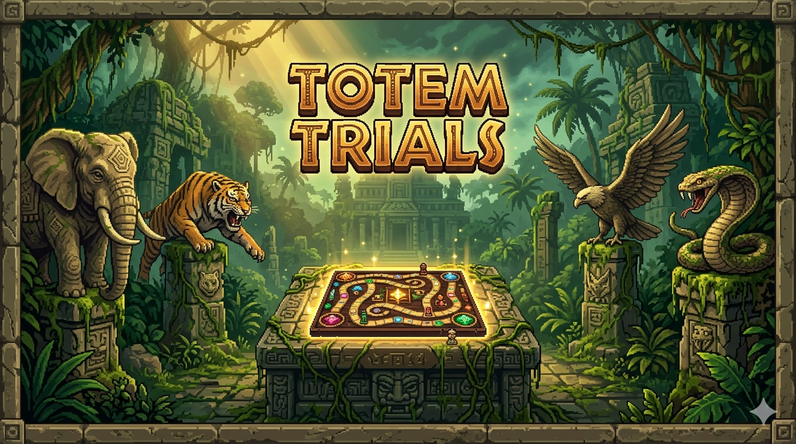
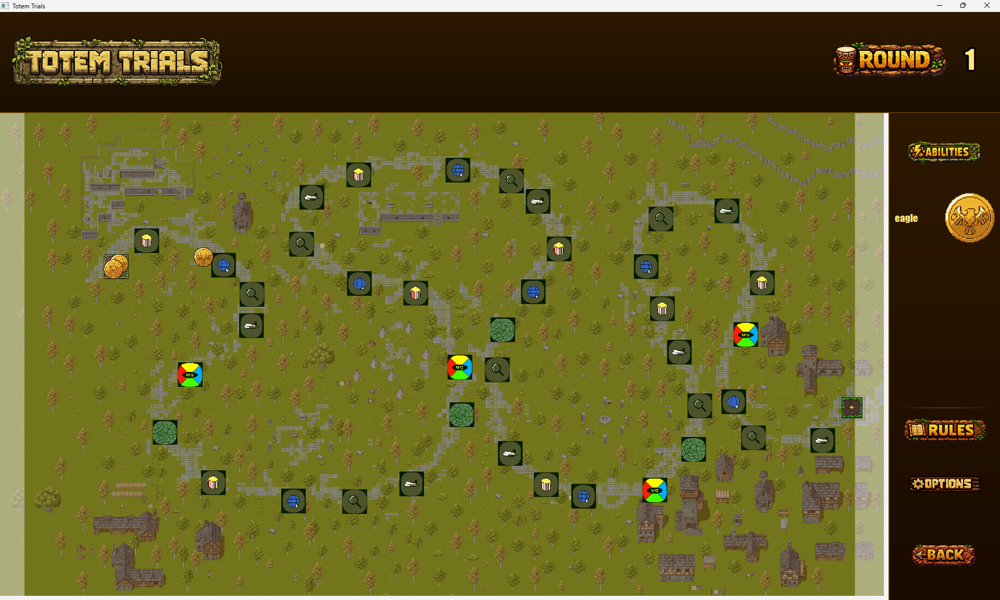

# Totem Trials — La Conquête de Jumanji

<div align="center">



> **Multiplayer trivia board game — Java 17 / JavaFX 25, Jumanji universe.**

[](https://openjdk.org/)
[](https://openjfx.io/)
[](https://maven.apache.org/)
[](https://junit.org/junit5/)
[]()
[]()

</div>

---

## Table of Contents

- [Overview](#overview)
- [Gameplay](#gameplay)
- [Board Layout](#board-layout)
- [Characters & Passives](#characters--passives)
- [Special Tiles](#special-tiles)
- [Architecture](#architecture)
- [Data Format](#data-format)
- [Setup & Run](#setup--run)
- [Project Structure](#project-structure)
- [Release Plan](#release-plan)
- [Team](#team)

---

## Overview

**Totem Trials** is a 2–4 player trivia board game developed as a Java integration project at [HELHa](https://www.helha.be/) (Haute École Louvain en Hainaut, Mons), academic year 2025–2026.

TTMC-style trivia mechanics wrapped in a pixel-art Jumanji aesthetic. Players pick a character with a unique passive, race across a jungle board toward the finish tile, answer questions by difficulty bracket, trigger duels, and use abilities at the right moment.

<div align="center">



</div>

---

## Gameplay

### Objective

Be the first player to reach the **finish tile** and correctly answer the final question to claim victory.

### Question Themes

| Theme | Content |
|-------|---------|
| Divertissement | Movies, TV series, video games |
| Informatique | CS concepts, programming |
| Tourisme | Geography, landmarks, world travel |
| Mystère Jumanji | Jumanji universe trivia |

Difficulty ranges from **1** (easy) to **4** (expert), declared by the player before seeing the question.

### Turn Flow

```
1. LAND       → tile color determines available themes
2. SELF-EVAL  → player declares confidence 1–4 (= difficulty + tiles to advance if correct)
3. QUESTION   → 4 shuffled choices displayed
4. RESULT     → Correct: advance N tiles | Wrong: stay or retreat
```

---

## Board Layout

Spiral path of **42 tiles** on a 6144×3584 px pixel-art image.

| Type | Count | Color |
|------|-------|-------|
| Start | 1 | Pink |
| Divertissement | 8 | Blue |
| Informatique | 8 | Blue |
| Mystère | 8 | Blue |
| Tourisme | 8 | Blue |
| Versus | 4 | Yellow |
| HOP (shortcut) | 2 | Green |
| Bonus | 2 | Green |
| Finish | 1 | Pink |

The board view is a zoomable/scrollable `StackPane > Group > Pane`. Pawns are `ImageView` nodes positioned by absolute coordinates matching each tile's `layoutX`/`layoutY`.

---

## Characters & Passives

Each character has a **single-use passive ability** activated from the in-game sidebar.

| Character | Passive |
|-----------|---------|
| **Elephant** | Skip current question → receive a new one at same theme & difficulty |
| **Snake** | Switch question theme to any of the other 3 |
| **Eagle** | Place a hidden trap on the board; opponent who lands on it triggers a group penalty question |
| **Tiger** | Reduce answer choices from 4 to 2 |

---

## Special Tiles

| Tile | Effect |
|------|--------|
| **VS — Versus** | Challenge any opponent. Each picks the other's theme. Loser retreats 3 tiles. Draw = no effect. |
| **HOP — Shortcut** | Accept a question at min difficulty 3. Correct → shortcut. Wrong → retreat N tiles = difficulty chosen. |
| **Bonus** | Freely pick theme + difficulty. No penalty on failure; advance = difficulty on success. |
| **Finish** | Must answer a final question to win. Landing alone is not enough. |

---

## Architecture

### Design Pattern: STATE

The entire game lifecycle runs through the **State** pattern. Each state owns its transitions, UI updates, and business rules.

```
        ●
        │
        ▼
┌──────────────────────┐
│ InitialisationPartie │ ◄──────────────────────────┐
└──────────┬───────────┘                             │ [RestartPartie]
           │ [FinChargement]                         │
           ▼                                         │
      ┌─────────┐   [JoueurAppuieSurPause]   ┌───────────┐
      │ EnCours │ ──────────────────────────► │   Pause   │
      │         │ ◄────────────────────────── │           │
      └────┬────┘   [JoueurAppuieSurReprendre]└─────┬─────┘
           │ [JoueurAtteintCentre]                  │
           ▼                                        │ [JoueurAppuieSurQuitter]
      ┌──────────┐                                  │
      │ FinPartie│ ─────────────────────────────────┘
      └──────────┘
           │ [JoueurAppuieSurQuitter / RestartPartie]
           ▼
           ●
```

### MVC Package Structure

```
src/main/java/com/totemtrials/totemtrials/
├── model/
│   ├── Plateau.java                  # 42-tile board
│   ├── Case.java                     # Base tile
│   │   ├── CaseBonus.java
│   │   ├── CasePiege.java            # Trap (Eagle passive target)
│   │   ├── CaseDepart.java
│   │   ├── CaseFin.java
│   │   └── CaseRegle.java
│   ├── Joueur.java                   # Player: pseudo, position, character, passive state
│   ├── Personnage.java               # Character + passive logic
│   ├── Tour.java                     # Single turn: theme, difficulty, Q&A, result
│   ├── Manche.java                   # Round across all players
│   ├── DeroulementPartie.java        # Game loop (State machine host)
│   ├── EtatPartie.java               # State interface
│   │   ├── EtatInitialisationPartie.java
│   │   ├── EtatEnCours.java
│   │   ├── EtatEnPause.java
│   │   └── EtatFinPartie.java
│   ├── Question.java
│   ├── Reponse.java
│   ├── Theme.java
│   └── GestionnaireDeCartes.java     # JSON loader + question dispatcher
├── plateau/
│   └── BoardGameController.java      # Plateau.fxml controller
│                                     # Tile logic, pawn rendering,
│                                     # round counter, abilities sidebar,
│                                     # settings (sound), back navigation
├── view/
│   └── (JavaFX FXML scenes)
├── controller/
│   └── (menu, questions, stats, end screen controllers)
└── exception/
    └── (custom business exceptions)
```

### Scene Flow

```
Main Menu
├── Player count selection  (2 / 3 / 4 Players)
├── Character selection
└── Board  (Plateau.fxml)
    ├── Top bar: title image + round counter
    ├── Center: zoomable board (ScrollPane › Group › Pane 6144×3584)
    │   └── Tile rectangles + pawn ImageViews at absolute positions
    └── Right sidebar
        ├── Abilities button + description
        ├── Rules button
        ├── Options button (sound slider)
        └── Back button
            ├── Question overlay
            ├── Statistics screen  (BackGroundStatistique)
            └── End screen / Podium  (fondpodium.jpg)
                └── 1st / 2nd / 3rd with player tokens + Credits button
```

---

## Data Format

Questions are stored in `.json` files (one per theme) and loaded by `GestionnaireDeCartes`.

```json
[
    {
        "theme": "Tourism",
        "subject": "Tourism",
        "difficulty": 1,
        "question": "What is the most visited country in the world?",
        "answer": "France",
        "choices": ["France", "Spain", "USA", "China"]
    }
]
```

**Constraints:**
- `answer` must be one of the values in `choices`
- `difficulty` ∈ `{1, 2, 3, 4}`
- `choices` always has exactly **4 entries**
- Display order is shuffled at runtime — no hardcoded correct-answer position

---

## Setup & Run

### Prerequisites

| Tool | Version |
|------|---------|
| JDK | 17+ |
| JavaFX SDK | 25 |
| Maven | 3.8+ |

### Clone & Build

```bash
git clone https://github.com/<your-org>/totem-trials.git
cd totem-trials
mvn clean package
```

### Run

```bash
java --module-path /path/to/javafx-sdk/lib \
     --add-modules javafx.controls,javafx.fxml \
     -jar target/totem-trials.jar
```

> IntelliJ / Eclipse: add JavaFX SDK as module dependency, set `--add-modules javafx.controls,javafx.fxml` in VM options.

### Tests

```bash
mvn test
# Coverage → target/site/jacoco/index.html
```

---

## Project Structure

```
totem-trials/
├── src/
│   ├── main/
│   │   ├── java/com/totemtrials/totemtrials/
│   │   └── resources/
│   │       ├── fxml/
│   │       │   ├── Plateau.fxml
│   │       │   └── menu-fin.fxml
│   │       ├── images/
│   │       │   ├── plateau-jeu-javaFX.png
│   │       │   ├── TitreLong.png
│   │       │   ├── buttons/
│   │       │   │   ├── bouton-abilities.png
│   │       │   │   ├── bouton-settings.png
│   │       │   │   ├── bouton-round.png
│   │       │   │   └── bouton-back.png
│   │       │   └── tokens/
│   │       │       ├── jetonElephan.png
│   │       │       ├── jetonSnake.png
│   │       │       ├── jetonAigle.png
│   │       │       └── jetonTigre.png
│   │       └── css/
│   └── test/java/
├── data/
│   └── questions/
│       ├── divertissement.json
│       ├── informatique.json
│       ├── tourisme.json
│       └── mystere.json
├── docs/assets/
│   ├── plateau-jeu-javaFX.png
│   └── banner.png
├── pom.xml
└── README.md
```

---

## Release Plan

| Sprint | Deadline | Deliverables | Status |
|--------|----------|-------------|--------|
| **Sprint 0** | — | Questions JSON · Backlog · Class diagram · Board prototype | ✅ Done |
| **Sprint 1** | 24/02/2026 | MVC skeleton · State pattern · `Question` / `Theme` / `GestionnaireDeCartes` | ✅ Done |
| **Sprint 2** | 30/03/2026 | Playable prototype: board rendering, pawn movement, Q&A flow | ✅ Done |
| **Sprint Final** | 04/05/2026 | Full multiplayer · Character passives · Special tiles · End screen · Podium · Stats · Test report | ✅ Done |

---

## Team

| Name |
|------|
| Corentin **VANDEPUT** |
| Evan **CHENNEVIER** |
| Ethan **LECOMTE GRAMBRAS** |
| Gianni **NELIS** |

**Academic year:** 2025–2026 &nbsp;·&nbsp; **Class:** 2BI B1  
**Supervisors:** Laurent Godefroid · Audrey Kindermans · Alice Delzenne  
**Institution:** [HELHa](https://www.helha.be/) — Haute École Louvain en Hainaut, Mons

---

## Credits & Assets

### Board Tileset

The pixel-art assets used for the game board background are created by **[Cainos](https://cainos.itch.io/)** and were generously provided for free.

| Pack | Link |
|------|------|
| Pixel Art Top Down – Village | [cainos.itch.io/pixel-art-top-down-village](https://cainos.itch.io/pixel-art-top-down-village) |
| Pixel Art Top Down – Basic | [cainos.itch.io/pixel-art-top-down-basic](https://cainos.itch.io/pixel-art-top-down-basic) |

Huge thanks to Cainos for the quality work and for sharing it freely with the community. Go check out and support their work on itch.io.

---

<div align="center">

*Academic project — HELHa 2025–2026. Not licensed for redistribution.*

</div>
